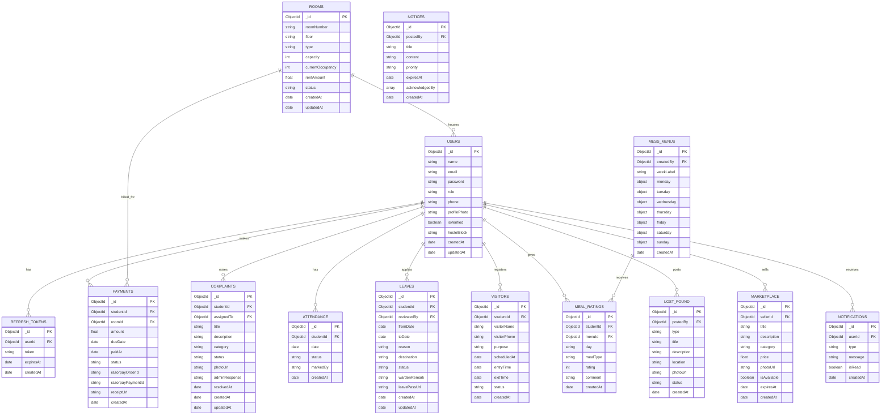

# ER Diagram – HostelOps v2.0 Database Design

```mermaid
erDiagram

    USERS {
        ObjectId _id PK
        string name
        string email
        string password
        string role
        string phone
        string profilePhoto
        boolean isVerified
        string hostelBlock
        date createdAt
        date updatedAt
    }

    REFRESH_TOKENS {
        ObjectId _id PK
        ObjectId userId FK
        string token
        date expiresAt
        date createdAt
    }

    ROOMS {
        ObjectId _id PK
        string roomNumber
        string floor
        string type
        int capacity
        int currentOccupancy
        float rentAmount
        string status
        date createdAt
        date updatedAt
    }

    PAYMENTS {
        ObjectId _id PK
        ObjectId studentId FK
        ObjectId roomId FK
        float amount
        date dueDate
        date paidAt
        string status
        string razorpayOrderId
        string razorpayPaymentId
        string receiptUrl
        date createdAt
    }

    COMPLAINTS {
        ObjectId _id PK
        ObjectId studentId FK
        ObjectId assignedTo FK
        string title
        string description
        string category
        string status
        string photoUrl
        string adminResponse
        date resolvedAt
        date createdAt
        date updatedAt
    }

    ATTENDANCE {
        ObjectId _id PK
        ObjectId studentId FK
        date date
        string status
        string markedBy
        date createdAt
    }

    LEAVES {
        ObjectId _id PK
        ObjectId studentId FK
        ObjectId reviewedBy FK
        date fromDate
        date toDate
        string reason
        string destination
        string status
        string wardenRemark
        string leavePassUrl
        date createdAt
        date updatedAt
    }

    NOTICES {
        ObjectId _id PK
        ObjectId postedBy FK
        string title
        string content
        string priority
        date expiresAt
        array acknowledgedBy
        date createdAt
    }

    VISITORS {
        ObjectId _id PK
        ObjectId studentId FK
        string visitorName
        string visitorPhone
        string purpose
        date scheduledAt
        date entryTime
        date exitTime
        string status
        date createdAt
    }

    MESS_MENUS {
        ObjectId _id PK
        ObjectId createdBy FK
        string weekLabel
        object monday
        object tuesday
        object wednesday
        object thursday
        object friday
        object saturday
        object sunday
        date createdAt
    }

    MEAL_RATINGS {
        ObjectId _id PK
        ObjectId studentId FK
        ObjectId menuId FK
        string day
        string mealType
        int rating
        string comment
        date createdAt
    }

    LOST_FOUND {
        ObjectId _id PK
        ObjectId postedBy FK
        string type
        string title
        string description
        string location
        string photoUrl
        string status
        date createdAt
    }

    MARKETPLACE {
        ObjectId _id PK
        ObjectId sellerId FK
        string title
        string description
        string category
        float price
        string photoUrl
        boolean isAvailable
        date expiresAt
        date createdAt
    }

    NOTIFICATIONS {
        ObjectId _id PK
        ObjectId userId FK
        string type
        string message
        boolean isRead
        date createdAt
    }

    USERS ||--o{ REFRESH_TOKENS : has
    ROOMS ||--o{ USERS : houses
    USERS ||--o{ PAYMENTS : makes
    ROOMS ||--o{ PAYMENTS : billed_for
    USERS ||--o{ COMPLAINTS : raises
    USERS ||--o{ ATTENDANCE : has
    USERS ||--o{ LEAVES : applies
    USERS ||--o{ VISITORS : registers
    USERS ||--o{ MEAL_RATINGS : gives
    USERS ||--o{ LOST_FOUND : posts
    USERS ||--o{ MARKETPLACE : sells
    USERS ||--o{ NOTIFICATIONS : receives
    MESS_MENUS ||--o{ MEAL_RATINGS : receives
```
