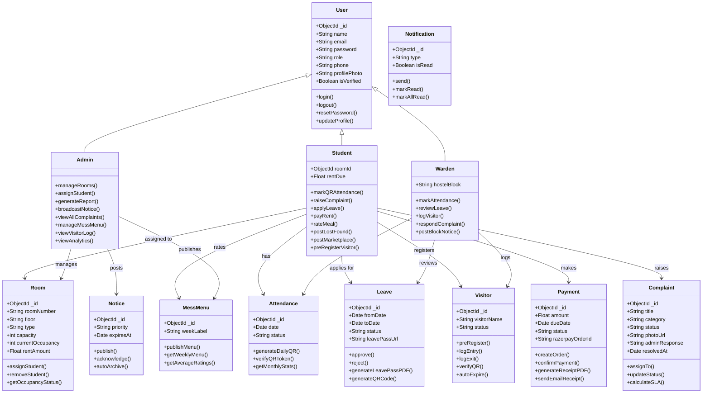

# Class Diagram – HostelOps v2.0 Backend Design

```mermaid
classDiagram

    class User {
        +ObjectId _id
        +String name
        +String email
        +String password
        +String role
        +String phone
        +String profilePhoto
        +Boolean isVerified
        +login()
        +logout()
        +resetPassword()
        +updateProfile()
    }

    class Admin {
        +manageRooms()
        +assignStudent()
        +generateReport()
        +broadcastNotice()
        +viewAllComplaints()
        +manageMessMenu()
        +viewVisitorLog()
        +viewAnalytics()
    }

    class Warden {
        +String hostelBlock
        +markAttendance()
        +reviewLeave()
        +logVisitor()
        +respondComplaint()
        +postBlockNotice()
    }

    class Student {
        +ObjectId roomId
        +Float rentDue
        +markQRAttendance()
        +raiseComplaint()
        +applyLeave()
        +payRent()
        +rateMeal()
        +postLostFound()
        +postMarketplace()
        +preRegisterVisitor()
    }

    class Room {
        +ObjectId _id
        +String roomNumber
        +String floor
        +String type
        +int capacity
        +int currentOccupancy
        +Float rentAmount
        +assignStudent()
        +removeStudent()
        +getOccupancyStatus()
    }

    class Payment {
        +ObjectId _id
        +Float amount
        +Date dueDate
        +String status
        +String razorpayOrderId
        +createOrder()
        +confirmPayment()
        +generateReceiptPDF()
        +sendEmailReceipt()
    }

    class Complaint {
        +ObjectId _id
        +String title
        +String category
        +String status
        +String photoUrl
        +String adminResponse
        +Date resolvedAt
        +assignTo()
        +updateStatus()
        +calculateSLA()
    }

    class Attendance {
        +ObjectId _id
        +Date date
        +String status
        +generateDailyQR()
        +verifyQRToken()
        +getMonthlyStats()
    }

    class Leave {
        +ObjectId _id
        +Date fromDate
        +Date toDate
        +String status
        +String leavePassUrl
        +approve()
        +reject()
        +generateLeavePassPDF()
        +generateQRCode()
    }

    class Notice {
        +ObjectId _id
        +String priority
        +Date expiresAt
        +publish()
        +acknowledge()
        +autoArchive()
    }

    class Visitor {
        +ObjectId _id
        +String visitorName
        +String status
        +preRegister()
        +logEntry()
        +logExit()
        +verifyQR()
        +autoExpire()
    }

    class MessMenu {
        +ObjectId _id
        +String weekLabel
        +publishMenu()
        +getWeeklyMenu()
        +getAverageRatings()
    }

    class Notification {
        +ObjectId _id
        +String type
        +Boolean isRead
        +send()
        +markRead()
        +markAllRead()
    }

    User <|-- Admin
    User <|-- Warden
    User <|-- Student
    Student --> Room : assigned to
    Student --> Payment : makes
    Student --> Complaint : raises
    Student --> Attendance : has
    Student --> Leave : applies for
    Student --> Visitor : registers
    Student --> MessMenu : rates
    Admin --> Room : manages
    Admin --> Notice : posts
    Admin --> MessMenu : publishes
    Warden --> Attendance : marks
    Warden --> Leave : reviews
    Warden --> Visitor : logs
```
