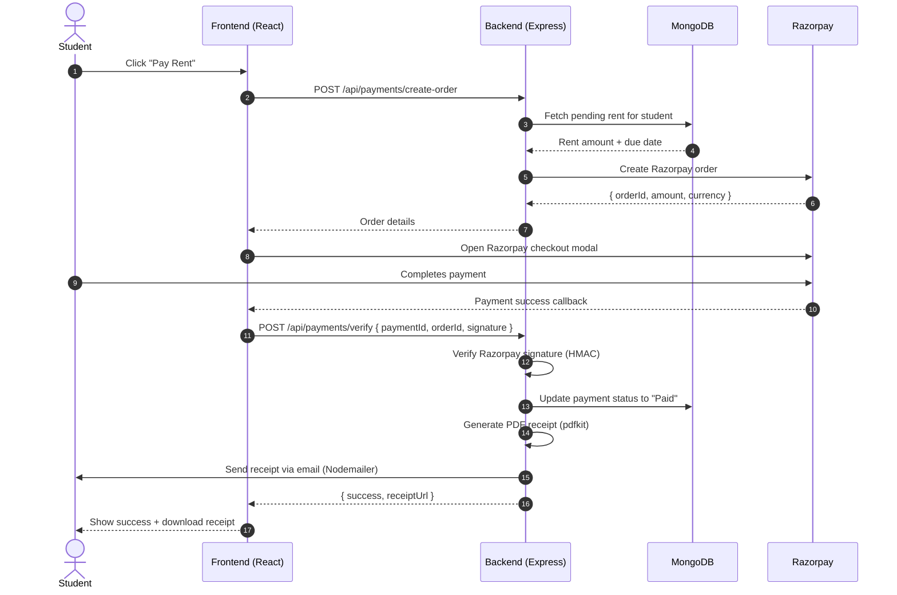
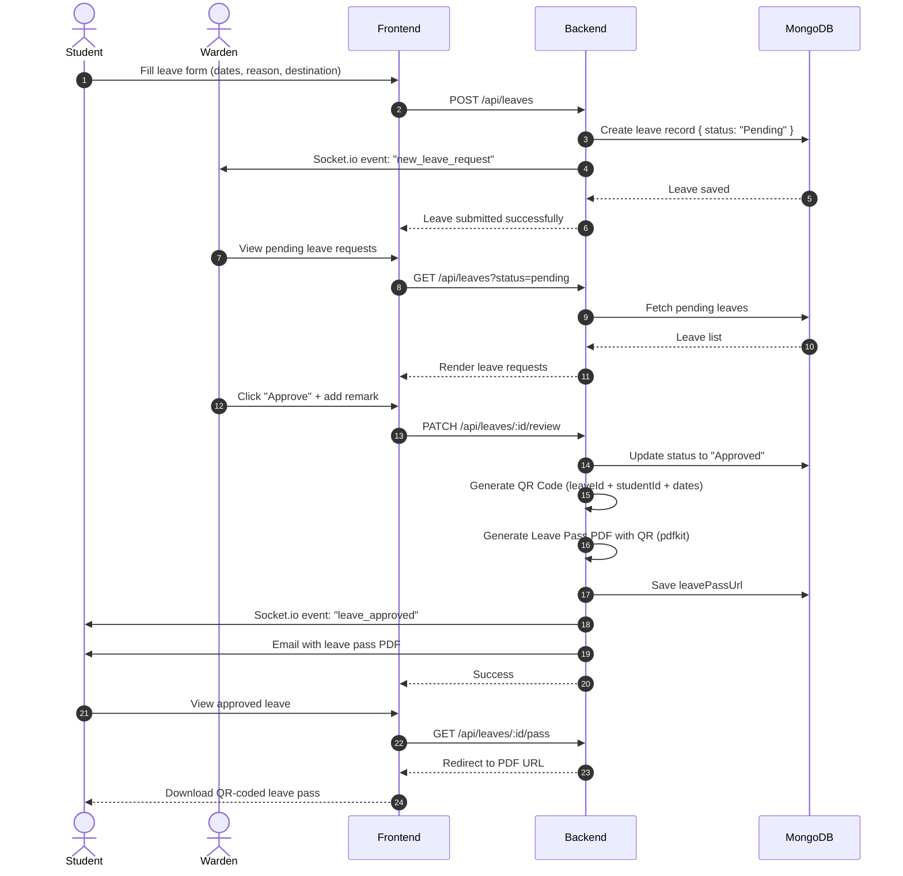
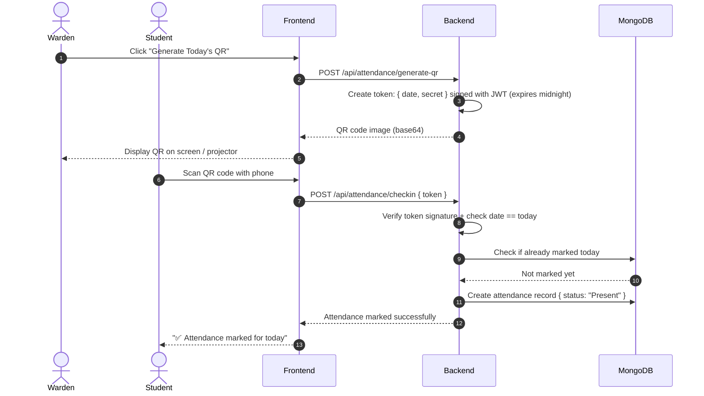
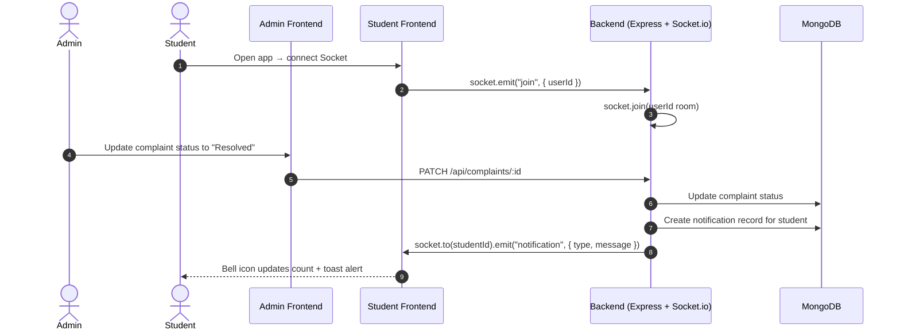

# Sequence Diagrams – HostelOps v2.0

---

## 1. Rent Payment Flow (Razorpay + Webhook)

---

## 2. Leave Application → QR Leave Pass Flow

---

## 3. QR Attendance Flow (Daily Rotating Token)

---

## 4. Real-Time Notification Flow (Socket.io)

